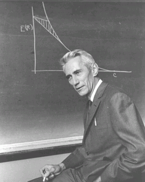

## Information Theory

* Invented by Claude Shannon

* Information theory: Shannon discovered these formulas about information transmission. How many bits per second should be able to transfer over various media. Coined the term "bit".

* Shannon entropy or level of surprise in a message/communication

## Shannon works

* A symbolic analysis of relay and switching circuits (https://dspace.mit.edu/handle/1721.1/11173)
